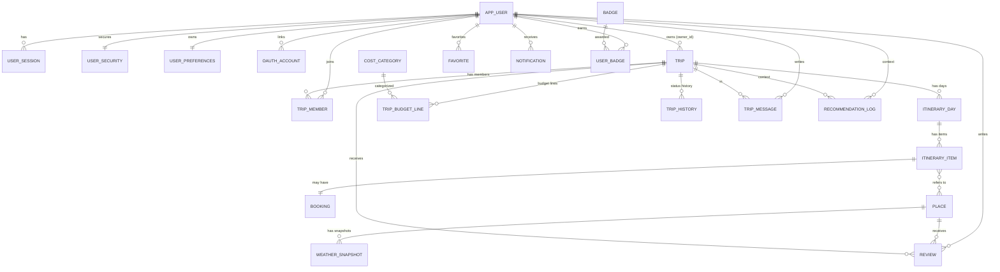

# Mermaid ERD for Tailored2Trips

```mermaid
erDiagram
  APP_USER ||--o{ USER_SESSION : has
  APP_USER ||--|| USER_SECURITY : secures
  APP_USER ||--|| USER_PREFERENCES : owns
  APP_USER ||--o{ OAUTH_ACCOUNT : links
  APP_USER ||--o{ TRIP : "owns (owner_id)"
  APP_USER ||--o{ TRIP_MEMBER : "joins"
  TRIP ||--o{ TRIP_MEMBER : "has members"
  TRIP ||--o{ ITINERARY_DAY : "has days"
  ITINERARY_DAY ||--o{ ITINERARY_ITEM : "has items"
  ITINERARY_ITEM ||--|| BOOKING : "may have"
  ITINERARY_ITEM }o--o{ PLACE : "refers to"
  PLACE ||--o{ WEATHER_SNAPSHOT : "has snapshots"

  TRIP ||--o{ TRIP_BUDGET_LINE : "budget lines"
  COST_CATEGORY ||--o{ TRIP_BUDGET_LINE : "categorized"

  APP_USER ||--o{ REVIEW : "writes"
  PLACE ||--o{ REVIEW : "receives"
  TRIP ||--o{ REVIEW : "receives"

  APP_USER ||--o{ FAVORITE : "favorites"
  TRIP ||--o{ TRIP_HISTORY : "status history"

  APP_USER ||--o{ NOTIFICATION : "receives"
  APP_USER ||--o{ USER_BADGE : "earns"
  BADGE ||--o{ USER_BADGE : "awarded"

  APP_USER ||--o{ TRIP_MESSAGE : "writes"
  TRIP ||--o{ TRIP_MESSAGE : "in"

  APP_USER ||--o{ RECOMMENDATION_LOG : "context"
  TRIP ||--o{ RECOMMENDATION_LOG : "context"
```
