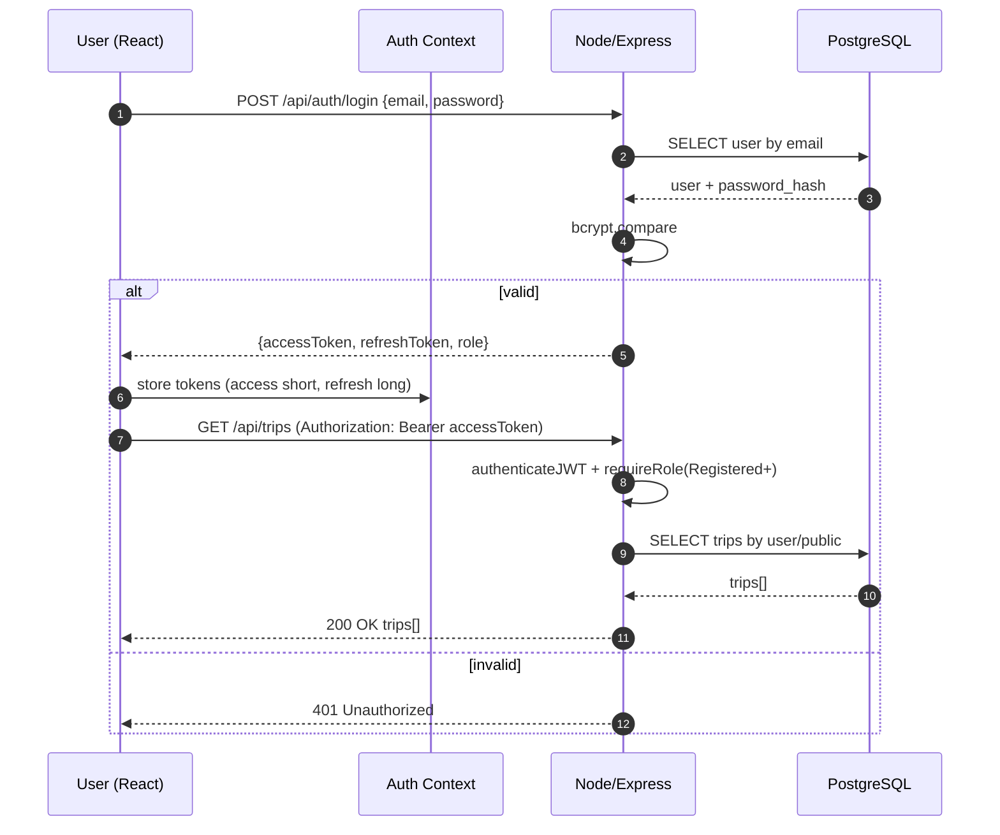

# Sequence Diagram — Login & Access Protected Route

```mermaid
sequenceDiagram
  autonumber
  participant U as User (React)
  participant A as Auth Context
  participant API as Node/Express
  participant DB as PostgreSQL

  U->>API: POST /api/auth/login {email, password}
  API->>DB: SELECT user by email
  DB-->>API: user + password_hash
  API->>API: bcrypt.compare
  alt valid
    API-->>U: {accessToken, refreshToken, role}
    U->>A: store tokens (access short, refresh long)
    U->>API: GET /api/trips (Authorization: Bearer accessToken)
    API->>API: authenticateJWT + requireRole(Registered+)
    API->>DB: SELECT trips by user/public
    DB-->>API: trips[]
    API-->>U: 200 OK trips[]
  else invalid
    API-->>U: 401 Unauthorized
  end
```
