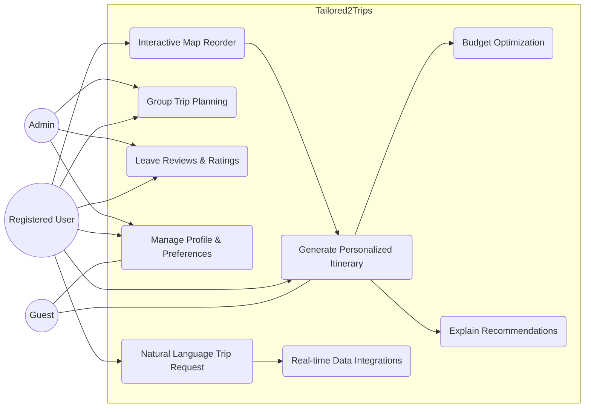

# Use Case Diagram (Mermaid)

```mermaid
flowchart LR
  subgraph System[Tailored2Trips]
    UC1(Generate Personalized Itinerary)
    UC2(Natural Language Trip Request)
    UC3(Group Trip Planning)
    UC4(Leave Reviews & Ratings)
    UC5(Manage Profile & Preferences)
    UC6(Budget Optimization)
    UC7(Explain Recommendations)
    UC8(Interactive Map Reorder)
    UC9(Real-time Data Integrations)
  end

  Guest((Guest)) --- UC1
  Guest --- UC5
  Registered((Registered User)) --> UC1
  Registered --> UC2
  Registered --> UC3
  Registered --> UC4
  Registered --> UC5
  Registered --> UC8

  Admin((Admin)) --> UC5
  Admin --> UC3
  Admin --> UC4

  UC1 --> UC6
  UC1 --> UC7
  UC2 --> UC9
  UC8 --> UC1
```
